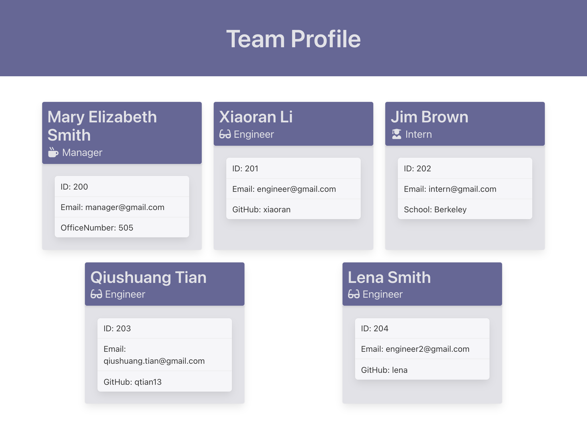
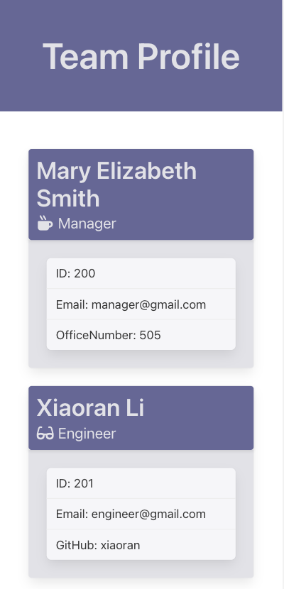

# Team Profile Generator
This project is to build a Node.js command-line application that takes in information about employees on a software engineering team, then generates an HTML webpage that displays summaries for each person.
## Table of Contents
* [Installation](#installation)
* [Built With](#built-with)
* [Features](#features)
* [HTML Information and Screen Shot](#html-information-and-screen-shot)
* [Demo Video URL](#demo-video-url)
* [Demo GIF](#demo-gif)
* [Tests](#tests)
* [Questions](#questions)
* [Acknowledgments](#acknowledgments)
## Installation
```console
git clone https://github.com/qtian13/team_profile_generator.git
npm init -y
npm i inquirer
node index.js
```
## Built With
* [HTML](https://developer.mozilla.org/en-US/docs/Web/HTML)
* [CSS](https://developer.mozilla.org/en-US/docs/Web/CSS)
* [Bulma](https://bulma.io/)
* [JavaScript](https://www.javascript.com/)
* [NodeJS](https://nodejs.org/en/)
* [npm](https://www.npmjs.com/)

## Features
1. When user start the application, they are prompted to enter the team manager’s name, employee ID, email address, and office number
2. After enter all the answers, the user is presented with a menu with options to add an engineer or an intern or to finish building their team.
3. When user select the engineer option, they are prompted to enter the engineer’s name, ID, email, and GitHub username, and then taken back to the menu.
4. When user select the intern option, they are prompted to enter the intern’s name, ID, email, and school, and then taken back to the menu.
5. When user decide to finish building their team, then they exit the application, and the HTML that displays a nicely formatted team roster based on the answers would be generated.
6. The path to HTML file is ./dist/index.html.
7. When user click on an email address in the HTML, then their default email program opens and populates the TO field of the email with the address
8. When user click on the GitHub username, that GitHub profile opens in a new tab.
9. The page layout is screen size responsive.

## HTML Information and Screen Shot
URL: https://github.com/qtian13/team_profile_generator/blob/main/dist/index.html




## Tests
```bash
npm test
```

## Demo Video URL
https://drive.google.com/file/d/1ceHfjiIAoxS3626KpedoWYaerQ1dR7rv/view

## Demo GIF


## Author
Qiushuang Tian
- [Link to Portfolio Site](https://qtian13.github.io/)
- [Link to Github](https://github.com/qtian13)
- [Link to LinkedIn](https://www.linkedin.com/in/qiushuang-tian-a9754248/)

## Questions
Please reach me out with additional questions!

Emails: qiushuang.tian@gmail.com

## Acknowledgments
- [Berkeley Coding Boot Camp](https://bootcamp.berkeley.edu/coding/) provided mock up image